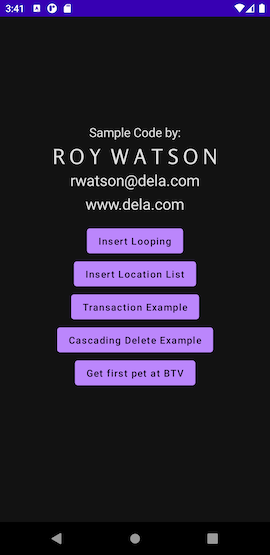

### "AndroidComposeRoomExample" example project by:

##       Roy Watson

rwatson@dela.com

www.dela.com

This is a simple example that strips out a lot of generally accepted architectural components and other proclaimed best practices. It is using the minimum of dependencies, frameworks and libraries in order to avoid obscuring the illustration of using the Room database library. 

##### Branches:

"start" branch is the raw templated project created by Android Studio Chipmunk | 2021.2.1 Patch 2. This is supplied for comparison purposes.

"complete" branch is the example/tutorial application where the "magic"😀 happens.  ***It appears you are currently on this branch.***

##### This example demonstrates/teaches:

- Room database

##### This example also includes/uses:

- Kotlin
- Compose
- View Model

### How to best use this demo:

The starting point of this app was the template for a new project in Android Studio Chipmunk | 2021.2.1 Patch 2 called “Fragment + ViewModel” and using Kotlin. You can create an empty project based on that template and compare it to this project to discern what needs to be done to get your project started with the Room database library. 

First, as always, we need to add the neccessary dependencies to the project. In the app level build.gradle file I hsve marked my additions with comments. These additions in turn require version updates to other dependencies and settings. Once you have made my additions, Android Studio will help you identify the other required changes. Be patient as it might take a few iterations and pay close attention to the build output messages.	

Next we should define our database and it's schema. For this example I setup a database of family pets and where the family lived at the time the pet was a family member. I hard-coded the source of these data in com.delasystems.androidcomposeroomexample.datasource.DataCollections.kt. In other situations the data could come from REST calls or any other source. For simplicity we are hardcoding it right into the app. This would rarely be the best choice.

Since our database will be made up of tables whioch are made up of columns let's start by creating our tables, which in Room are called entities and are annotated with @Entity. They live in com.delasystems.androidcomposeroomexample.database.Entities.kt. You can read about the syntax and the various annotations I used in that file at https://developer.android.com/training/data-storage/room/defining-data .

In com.delasystems.androidcomposeroomexample.database.PetDatabase.kt I assemble the entities into a database. There is a discussion of this at https://developer.android.com/training/data-storage/room .

The work of inserting data and querying it is done in DAO which is in com.delasystems.androidcomposeroomexample.database.PetDataDao.kt which is also discussed in the above link.

In the DAO I demonstrate different ways of doing insertions such as singular insertion and inserting lists. I also show how to construct a transaction to ensure data integrity. For clarity, I have bypassed using a repository which would be best practice. Instead these are called directly from the ViewModel in response to stimuli originating in the Compose UI MainActivity.

Thank you and if you have ny comments or questions please feel free to contact me at rwatson@dela.com

## License:

    Copyright (C) 2022 Roy Watson
    
    Permission is hereby granted, free of charge, to any person obtaining a copy of this
    software and associated documentation files (the "Software"), to deal in the Software 
    without restriction, including without limitation the rights to use, copy, modify, merge, 
    publish, distribute, sublicense, and/or sell copies of the Software, and to permit persons 
    to whom the Software is furnished to do so, subject to the following conditions:
    
    The above copyright notice and this permission notice shall be included in all copies 
    or substantial portions of the Software.
    
    THE SOFTWARE IS PROVIDED "AS IS", WITHOUT WARRANTY OF ANY KIND, EXPRESS OR IMPLIED, 
    INCLUDING BUT NOT LIMITED TO THE WARRANTIES OF MERCHANTABILITY, FITNESS FOR A PARTICULAR
    PURPOSE AND NONINFRINGEMENT. IN NO EVENT SHALL THE AUTHORS OR COPYRIGHT HOLDERS BE LIABLE
    FOR ANY CLAIM, DAMAGES OR OTHER LIABILITY, WHETHER IN AN ACTION OF CONTRACT,
    TORT OR OTHERWISE, ARISING FROM, OUT OF OR IN CONNECTION WITH THE SOFTWARE OR THE USE
    OR OTHER DEALINGS IN THE SOFTWARE.

